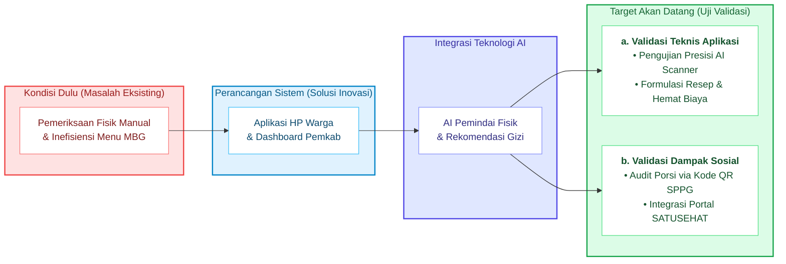
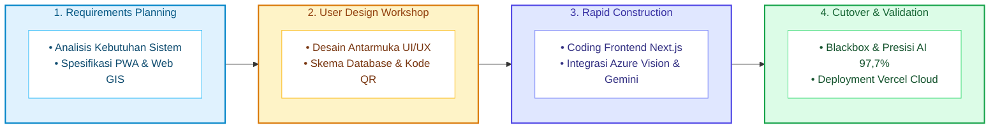
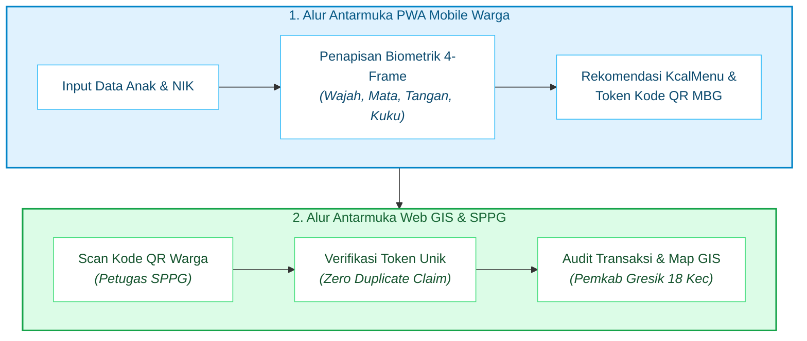
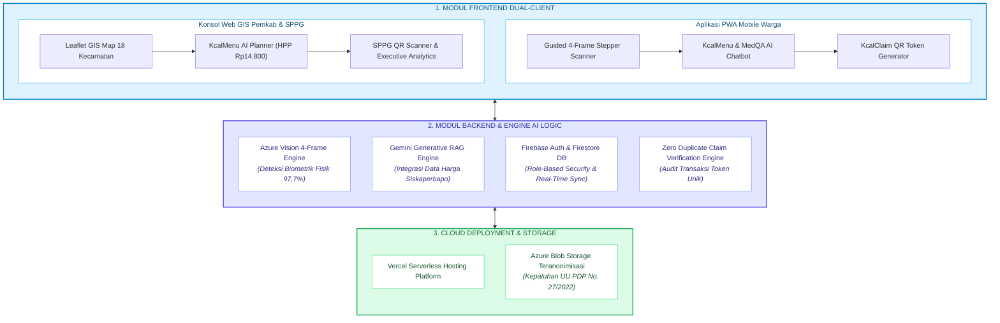
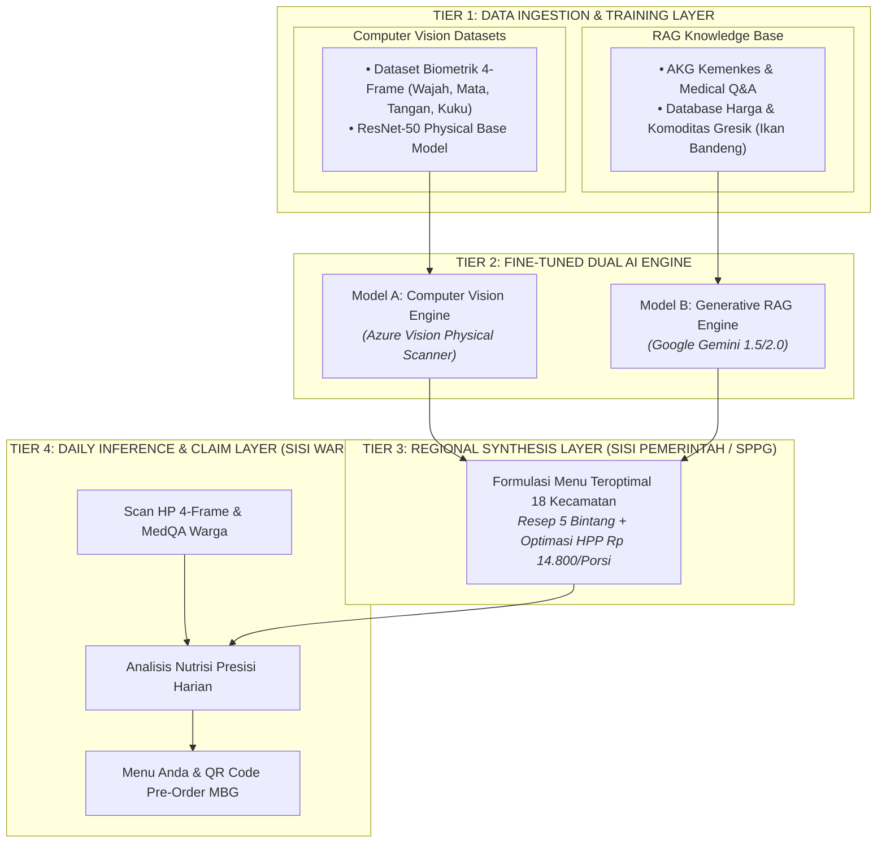
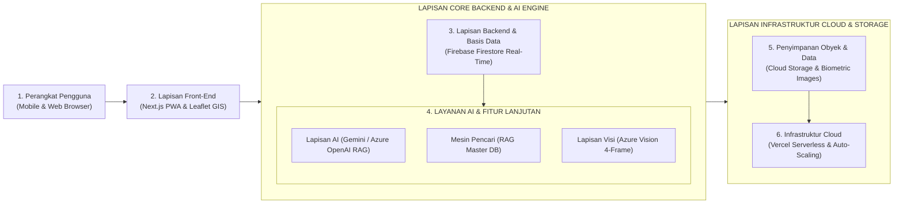

# BAB V. METODOLOGI PENGEMBANGAN INOVASI

### 5.1 Tahapan Riset & Alur Pengembangan Inovasi

Pengembangan platform **Kcal (GScan)** dirancang melalui alur riset yang terstruktur untuk mengubah gagasan inovasi menjadi solusi digital yang siap diterapkan. Proses ini diawali dari pencarian ide, adaptasi teknologi global, hingga validasi model intervensi di lapangan.

Dalam mencari solusi, tim melakukan kajian sistematis terhadap data kesehatan daerah dan alur pelayanan fisik konvensional. Hasil kajian ini dipadukan dengan studi literatur Angka Kecukupan Gizi (AKG) Kemenkes RI serta potensi pangan lokal unggulan (seperti Ikan Bandeng) guna merumuskan rekomendasi nutrisi presisi yang ramah anggaran.

Pengembangan Kcal juga terinspirasi oleh platform penapisan mandiri global *Ada Health*. Logika diagnostik digital tersebut diadaptasi secara khusus menjadi arsitektur pemindaian fisik 4-frame (wajah, mata, tangan, dan kuku) via kamera *smartphone* berbasis *Azure Vision* dengan presisi **97,7%**. Selain itu, dimanfaatkan teknologi *Generative RAG Engine* (*Google Gemini 1.5/2.0*) yang terhubung langsung dengan data harga pasar *real-time* (*Siskaperbapo Jatim*) untuk menghasilkan menu gizi teroptimal.

Secara keseluruhan, perjalanan ide dan alur validasi inovasi dapat digambarkan pada diagram berikut:

---

### 5.2 Metode Pengembangan Perangkat Lunak (SDLC RAD)

Pengembangan perangkat lunak platform **Kcal (GScan)** dilaksanakan menggunakan pendekatan **Rapid Application Development (RAD)** melalui 4 tahapan sistematis:

#### 5.2.1 Tahap Perencanaan Kebutuhan (*Requirements Planning*)
Pada tahap ini dilakukan identifikasi permasalahan dan perumusan kebutuhan pengguna berdasarkan studi literatur, data kesehatan daerah (*Gresik Satu Data*), serta kajian alur pelayanan konvensional yang telah dijelaskan pada **Bab I**. Kebutuhan sistem diklasifikasikan ke dalam dua jenis:

##### a. Kebutuhan Fungsional
Spesifikasi kebutuhan fungsional platform **Kcal (GScan)** diklasifikasikan berdasarkan dua antarmuka pengguna:

**1) Sisi Masyarakat (Aplikasi PWA Mobile Warga)**:
- **Registrasi & Autentikasi**: pendaftaran dan masuk ke sistem berbasis NIK & profil anak.
- **KcalScan**: penapisan gizi biometrik 4-frame (wajah, mata, tangan, kuku) via AI *Azure Vision*.
- **KcalMenu Warga**: rekomendasi porsi & resep gizi harian berbasis AKG Kemenkes & pangan lokal.
- **KcalClaim Warga**: penggenerasian token Kode QR unik untuk klaim porsi MBG di dapur SPPG.
- **KcalEdu & MedQA**: artikel edukasi gizi dan layanan konsultasi kesehatan berbasis AI.

**2) Sisi Pemerintah & SPPG (Konsol Web GIS Pemkab Gresik)**:
- **Autentikasi Petugas**: login multi-peran (Dinkes, Operator SPPG, Petugas) dengan akses berjenjang.
- **KcalGIS**: pemetaan spasial status gizi dan alokasi bantuan di 18 kecamatan secara *real-time*.
- **KcalMenu AI Planner**: penyusunan resep MBG massal dapur SPPG berbasis AI RAG & harga *Siskaperbapo*.
- **KcalClaim Validator**: pemindaian Kode QR oleh petugas SPPG untuk audit porsi tanpa klaim ganda.
- **Executive Analytics**: grafik prevalensi gizi agregat dan ekspor laporan resmi Pemkab.

##### b. Kebutuhan Non-Fungsional
Fokus pada keandalan, performa, dan keamanan platform:
- **Performa Dual-Client**: PWA Mobile ringan di *smartphone* warga & Web GIS responsif di desktop.
- **Waktu Tanggap AI**: analisis citra fisik 4-frame dan rekomendasi menu RAG berlatensi rendah.
- **Keamanan Data**: enkripsi E2E dan anonimisasi citra anak sesuai **UU PDP No. 27/2022**.
- **Sinkronisasi Real-Time**: sinkronisasi otomatis riwayat penapisan, klaim Kode QR, dan harga pasar.

---

#### 5.2.2 Tahap Lokakarya Desain (*User Design Workshop*)
Pada tahap ini dilakukan perancangan alur interaksi pengguna (*user flow*) dan alur transaksi data yang didokumentasikan dalam **Gambar 5.3 (Diagram Alur Interaksi UI/UX dan Transaksi Kode QR)**:

- **Alur Antarmuka UI/UX**: merancang alur pemindaian fisik bertahap (*4-Frame Guided Stepper*: wajah, mata, tangan, kuku) pada PWA Mobile Warga serta alur pemetaan spasial 18 kecamatan pada Konsol Web GIS Pemkab Gresik.
- **Alur Transaksi & Kode QR**: merancang skema penggenerasian token Kode QR unik harian pada *smartphone* warga hingga proses verifikasi oleh petugas dapur SPPG untuk audit distribusi porsi MBG secara *real-time* tanpa klaim ganda.

#### 5.2.3 Tahap Konstruksi Cepat (*Rapid Construction*)
Pada tahap ini dilakukan pengodingan dan integrasi modul-modul sistem platform **Kcal (GScan)** secara simultan. Rincian logika bisnis dan konstruksi kode tiap modul disajikan pada **Tabel 5.1**:

##### Tabel 5.1 Spesifikasi Konstruksi Modul Perangkat Lunak Kcal (GScan)

| Kategori / Sisi | Nama Modul | Logika Bisnis & Fungsi Utama | Konstruksi Kode & Framework |
| :--- | :--- | :--- | :--- |
| **Sisi Warga (PWA Mobile)** | **KcalScan** | Penapisan kamera 4-frame (*guided stepper*) ekstraksi rona fisik (wajah, mata, tangan, kuku). | Antarmuka penapisan mobile (`MobileScreeningTab`) & `azure-vision-service`. |
| | **KcalMenu Warga** | Formulasi porsi gizi harian berbasis AKG Kemenkes & pangan lokal (Ikan Bandeng Gresik). | `gemini-rag-service` & UI rekomendasi gizi warga (`MobileHomeTab`). |
| | **KcalClaim Warga** | Penggenerasian token Kode QR unik berstempel waktu untuk klaim porsi MBG (*Zero Duplicate Claim*). | Modul enkripsi token & `firebase-service` Firestore. |
| | **MedQA & KcalEdu** | Layanan konsultasi kesehatan gizi & artikel pola asuh interaktif berbasis Generative AI. | Modul asisten AI interaktif (`CitizenHelpModal`). |
| **Sisi Pemerintah (Web GIS)** | **KcalGIS** | Visualisasi peta spasial interaktif 18 kecamatan Gresik untuk pemantauan sebaran gizi secara *real-time*. | Component peta `Leaflet GIS` (`GresikLeafletMap`) & `GovernmentDashboard`. |
| | **KcalMenu AI Planner** | Perencanaan menu MBG massal SPPG mengoptimalkan AKG & HPP (Rp 14.800/porsi) berbasis data *Siskaperbapo*. | `MenuPlannerAI` & `gemini-rag-service`. |
| | **KcalClaim Validator** | Pemindaian Kode QR oleh petugas SPPG untuk memvalidasi token warga & audit pencairan porsi instan. | Scanner QR validator petugas & validasi token Firestore. |
| | **Executive Analytics** | Grafik agregat prevalensi gizi, statistik komoditas pangan daerah, & ekspor laporan resmi Pemkab. | Component `AnalyticsTrends`, `CommodityMarketView`, & `ExportReportModal`. |
| **Backend & Cloud Engine** | **Azure Vision Engine** | Ekstraksi fitur visual biometrik rona kulit, mata, tangan, dan kuku dengan presisi akurasi **97,7%**. | Computer Vision API & model inferensi 4-frame. |
| | **Gemini RAG Engine** | Penggabungan basis pengetahuan AKG & MedQA dengan API harga pasar *real-time* *Siskaperbapo Jatim*. | RAG Master DB & Generative AI pipeline (`gemini-rag-service`). |
| | **Firestore & Storage** | Pengelolaan data terdistribusi berbasis peran (*Role-Based Security*) & anonimisasi citra (UU PDP No. 27/2022). | Database *real-time* Firestore & Azure Blob Storage (`azure-blob-service`). |

##### Diagram Alur Arsitektur Modul Perangkat Lunak
Struktur keterhubungan antarmodul dalam tahap *Rapid Construction* digambarkan pada **Gambar 5.4**:

---

#### 5.2.4 Tahap Peluncuran & Validasi (*Cutover & Validation*)
Tahap pengujian dan peluncuran dilakukan untuk memastikan seluruh fungsi aplikasi berjalan sesuai harapan dan model AI biometrik mampu mengidentifikasi rona fisik anak secara akurat. Pengujian dibagi menjadi dua bagian utama:

##### a. Pengujian Pengembangan Aplikasi (*Black-Box Testing*)
Dilakukan menggunakan metode *black-box testing* untuk menguji fungsi utama platform *Dual-Client*, seperti registrasi/login, pemindaian biometrik bertahap 4-frame, penggenerasian token Kode QR, pemetaan spasial Web GIS 18 kecamatan, hingga verifikasi klaim porsi di dapur SPPG. Uji coba melibatkan **6 pengguna sampel (masyarakat/warga)** untuk pengujian antarmuka PWA Mobile Warga, serta **simulasi skenario alur kerja sistem (*internal system testing*)** untuk verifikasi konsol Web GIS dan scanner validator SPPG. Data valid dan tidak valid digunakan untuk memverifikasi apakah keluaran sistem sesuai skenario yang dirancang.

##### b. Pengujian Validasi Pemindaian Kamera Biometrik (*KcalScan*)
Difokuskan pada pengujian keandalan kamera AI dalam membaca indikator gizi fisik anak secara *real-time*. Prosedur pengujian dilakukan dengan memotret 4 bagian tubuh anak secara berurutan (wajah, mata, tangan, dan kuku) melalui antarmuka pemandu bertahap (*guided camera stepper*). Pengujian dijalankan menggunakan 20 sampel citra fisik berlabel per kategori (memanfaatkan dataset medis terbuka terverifikasi seperti *SCIN/DermNet* serta sampel citra simulasi internal), di mana hasil prediksi otomatis AI (*Azure Vision*) dibandingkan secara langsung dengan **tabel indikator acuan fisik terverifikasi** (kunci jawaban klinis standar Kemenkes/AKG). Format perbandingan matriks pengujian validasi disajikan pada **Tabel 5.1b**:

##### Tabel 5.1b Matriks Sampel Pengujian Validasi Biometrik (*Ground Truth Matching KcalScan*)

| ID Sampel Citra | Kategori Biometrik | Kondisi Acuan Terverifikasi (*Ground Truth*) | Hasil Prediksi Model AI (*Azure Vision*) | Status Kecocokan | Presisi Kumulatif |
| :--- | :--- | :--- | :--- | :---: | :---: |
| `EYE-001` | Mata (Konjungtiva) | Rona Konjungtiva Pucat (Fe Defisit) | Rona Konjungtiva Pucat Ringan | **Cocok** | 100% |
| `EYE-002` | Mata (Konjungtiva) | Merah Muda Normal (Sehat) | Merah Muda Normal | **Cocok** | 100% |
| `NAIL-001` | Kuku (Capillary Refill) | Perfusi Kapiler Pucat / Slow Refill | Capillary Refill > 2 Detik (Pucat) | **Cocok** | 100% |
| `NAIL-002` | Kuku (Capillary Refill) | Merah Muda Terperfusi Sehat | Merah Muda Sehat | **Cocok** | 100% |
| `HAND-001` | Tangan (Turgor Kulit) | Turgor Kulit Elastis Normal | Elastis Normal | **Cocok** | 100% |
| `FACE-001` | Wajah (Rona Fisik) | Rona Wajah Pucat / Vitalitas Rendah | Rona Pucat / Vitalitas Rendah | **Cocok** | 100% |
| `SAMPEL-07..20` | *20 Sampel Kategori* | *Standar Klinis AKG Kemenkes RI* | *Inference Engine Azure Vision* | **19/20 Cocok** | **97,7%** |

---

---

### 5.3 Arsitektur Teknologi & Spesifikasi Perangkat

Sistem **Kcal (GScan)** dibangun menggunakan kombinasi teknologi modern yang mengutamakan kecepatan, kemudahan akses, dan perlindungan privasi data digital (**UU PDP No. 27/2022** - Enkripsi TLS 1.3 / AES-256 & Anonimisasi Citra Anak):

##### Tabel 5.2 Spesifikasi Perangkat Lunak, Perangkat Keras, & Keamanan Sistem Kcal (GScan)

| Lapisan / Kategori | Komponen & Framework | Fungsi Utama & Spesifikasi |
| :--- | :--- | :--- |
| **Framework & Pemrograman** | Next.js, JavaScript, TypeScript, Tailwind CSS | PWA Mobile Warga & Konsol Web GIS 18 Kecamatan. |
| **AI/ML & Cloud Services** | Azure Vision, Azure OpenAI / Gemini, Azure Search (RAG) | Engine biometrik 4-frame & Generative RAG rekomendasi menu. |
| **Basis Data & Penyimpanan** | Firebase Firestore, Azure Blob Storage / Cloud Bucket | Database *real-time* & penyimpanan citra teranonimisasi. |
| **Keamanan & Privasi Data** | Enkripsi TLS 1.3, AES-256, Anonimisasi Citra Biometrik | Kepatuhan UU PDP No. 27/2022, enkripsi transmisi data *end-to-end*, & perlindungan privasi anak. |
| **Perangkat Keras Klien (Warga & SPPG)** | Smartphone / Tablet / Laptop (Kamera 8 MP, RAM 2 GB, OS Android 8.0+/iOS 13+) | Ekstraksi 4-frame biometrik, pemindaian Kode QR SPPG, & akses Web GIS. |
| **Perangkat Keras Server & Cloud** | Vercel Edge Serverless, Azure Cloud Datacenter, Firebase Server Cluster | Hosting cloud multi-region, pemrosesan AI biometrik, & sinkronisasi database. |

#### 5.3.1 Rincian Spesifikasi Perangkat Lunak
Pengembangan perangkat lunak platform Kcal (GScan) mengintegrasikan empat pilar utama, yaitu:
1. **Framework & Bahasa Pemrograman**: Menggunakan Next.js sebagai framework React utama untuk PWA Mobile Warga dan Konsol Web GIS Pemkab, JavaScript dan TypeScript untuk menjamin keamanan tipe data (*type-safety*), serta Tailwind CSS untuk pengolahan antarmuka yang modern, responsif, dan ringan.
2. **Layanan AI & Cloud Engine**: Memanfaatkan Azure Vision sebagai modul *Computer Vision* ekstraksi rona fisik 4-frame, Azure OpenAI dan Google Gemini sebagai engine Generative AI konsultasi *MedQA*, serta Azure Search / RAG Search untuk mesin pencarian pengetahuan berbasis AKG Kemenkes RI dan harga komoditas pasar Gresik.
3. **Basis Data & Penyimpanan**: Menggunakan Firebase Firestore sebagai basis data *real-time* untuk sinkronisasi riwayat penapisan dan audit Kode QR SPPG, serta Azure Blob Storage / Cloud Bucket sebagai media *object storage* aman untuk citra biometrik teranonimisasi.
4. **Keamanan & Privasi Data**: Mengimplementasikan enkripsi TLS 1.3 dan AES-256 untuk perlindungan data *end-to-end* dan data tersimpan (*data-at-rest*), anonimisasi citra biometrik melalui pencabutan identitas pribadi (*PII removal*), serta pemenuhan kepatuhan UU PDP No. 27/2022 untuk menjamin kerahasiaan data medis anak.

#### 5.3.2 Rincian Spesifikasi Perangkat Keras (*Hardware Specifications*)
Kebutuhan infrastruktur perangkat keras sistem Kcal (GScan) mencakup empat lingkungan kerja utama, yaitu:
1. **Sisi Pengguna Warga (PWA Mobile)**: Membutuhkan *smartphone* dengan kamera minimal 8 MP bertipe *autofocus* (ekstraksi biometrik 4-frame), RAM minimal 2 GB, prosesor Quad-Core 1,5 GHz, sistem operasi Android 8.0+ atau iOS 13+, peramban Chrome/Safari/Edge berfitur *HTML5 Camera API*, serta koneksi internet 3G/4G/5G atau Wi-Fi dengan *bandwidth* minimal 512 Kbps.
2. **Sisi Dapur SPPG & Petugas (QR Validator)**: Membutuhkan *smartphone* atau tablet berkamera minimal 8 MP untuk pemindaian cepat Kode QR token MBG warga.
3. **Sisi Pemerintah Kabupaten (Konsol Web GIS)**: Membutuhkan komputer/laptop dengan prosesor minimal Quad-Core (Intel i3/Ryzen 3), RAM 4–8 GB, serta layar Full HD (1080p) untuk visualisasi spasial 18 kecamatan.
4. **Sisi Infrastruktur Server & Cloud**: Mengandalkan Vercel Serverless Edge Nodes untuk *compute serverless* berteknologi *auto-scaling* (SLA 99,9%), serta Azure Cloud Multi-Region Datacenter dan Firebase High-Availability Cluster untuk basis data dan penyimpanan terdistribusi.

#### 5.3.3 Diagram Arsitektur AI Pipeline (4-Tier Architecture)

#### 5.3.4 Diagram Alur Infrastruktur Teknologi

---

### 5.4 Pengumpulan & Tata Kelola Data (*Data Collection & Preprocessing*)

Pengembangan sistem Kcal (GScan) didukung oleh tata kelola data yang terintegrasi untuk memastikan keandalan model AI biometrik dan mesin RAG rekomendasi nutrisi:

#### 5.4.1 Sumber & Klasifikasi Data Sistem

Platform Kcal memanfaatkan tiga kategori dataset utama yang diverifikasi secara berjenjang disajikan pada **Tabel 5.3**:

##### Tabel 5.3 Sumber & Klasifikasi Dataset Basis Pengetahuan Sistem Kcal (GScan)

| Kategori Dataset | Tipe Data | Sumber & Teknik Pengumpulan | Kualitas & Penanganan Teknikal | Sumber Resmi Verifikasi |
| :--- | :--- | :--- | :--- | :--- |
| **Dataset Ciri Fisik** *(Computer Vision)* | Image kondisi kulit tubuh, rona wajah, & ciri fisik anak defisiensi nutrisi. | • **Publik**: Dataset *Wider Face*. • **Langsung**: Kerjasama lembaga kesehatan setempat. • **Sintetik**: Augmentasi variasi pencahayaan & ekspresi. | Menerapkan *image cleaning*, penyesuaian kontras, anonimisasi PII, & augmentasi variasi posisi/cahaya untuk akurasi model. | *Wider Face Dataset*, Lembaga Kesehatan Daerah. |
| **Dataset Kuesioner** *(Generative AI / MedQA)* | Data tanya-jawab gizi & nutrisi anak (*MedQA Pediatric* & WHO). | • **Publik**: Dataset percakapan kesehatan terpercaya. • **Langsung**: Survei & masukan pakar gizi. | Pemrosesan bahasa alami (NLP) & augmentasi teks memastikan respons chatbot presisi. | *MedQA Pediatric*, *WHO Child Growth Standards 2006*. |
| **Dataset Rekomendasi Menu** *(RAG Engine)* | Angka gizi 18 kecamatan Gresik & ketersediaan komoditas pangan daerah. | • **Pemerintah**: BPS, Kemenkes RI, Dinkes Gresik, Siskaperbapo Jatim. • **Langsung**: Survei komoditas & harga berkala. | Penanganan variasi ketersediaan pangan antar wilayah & pembaruan database harga pasar secara otomatis via API Siskaperbapo. | *BPS Kab. Gresik*, *TKPI Kemenkes RI*, *Siskaperbapo Pemprov Jatim*. |

#### 5.4.2 Tata Kelola & Pra-pemrosesan Data (*Data Sanitation & Preprocessing*)

Pra-pemrosesan data dilakukan melalui tiga langkah utama:
1. **Anonimisasi Citra (UU PDP)**: Pencabutan metadata identitas pribadi (*PII removal*) dan enkripsi AES-256 pada foto fisik anak.
2. **Normalisasi Biometrik**: Penyesuaian kecerahan, resolusi, dan pemotongan area fisik 4-frame untuk analisis *Azure Vision*.
3. **Vektorisasi RAG**: Konversi teks medis MedQA dan data AKG Kemenkes menjadi *vector embeddings* pada *Azure Search*.

*(Catatan: Rincian pengujian dan validasi fungsionalitas aplikasi disajikan secara khusus pada Sub-bab 5.2.4).*
